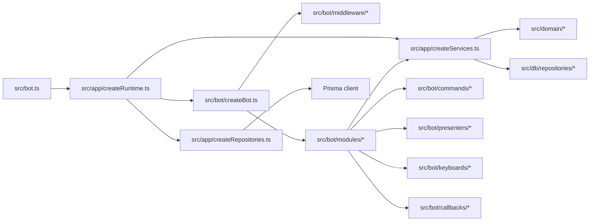

# Kvestarnia `0.2.x` Target Architecture

Status: proposed  
Primary implementation slice: `0.2.2 — Architecture Stabilization`

## Design principles

1. Preserve the current layered architecture.
2. Prefer explicit functions and typed objects over frameworks.
3. Keep grammY registration order visible.
4. Keep the public service APIs stable during a mechanical refactor.
5. Keep transaction boundaries in repositories/application services.
6. Add seams before adding abstraction.
7. Use architecture tests for important boundaries, not line counts alone.
8. No behavior change is an acceptance requirement, not an aspiration.

## Target flow



## Proposed directory additions

```text
src/
  app/
    applicationTypes.ts
    createRepositories.ts
    createServices.ts
    createRuntime.ts
    runtimeLifecycle.ts

  bot/
    botOptions.ts
    botServices.ts
    createBot.ts

    middleware/
      registerCombatLockMiddleware.ts
      registerPresenceMiddleware.ts
      pendingRaidGuard.ts

    modules/
      registerCoreBotModule.ts
      registerCharacterBotModule.ts
      registerInventoryBotModule.ts
      registerTavernBotModule.ts
      registerQuestBotModule.ts
      registerCombatBotModule.ts
      registerSocialBotModule.ts

    routing/
      callbackRegistration.ts      # optional, only if it stays small
      routePolicy.ts               # future/shared classification, not required in 0.2.2
```

Names may be adjusted to the post-`0.2.1` tree. The boundaries and ownership matter more than the exact filenames.

## `createBot.ts` responsibility

After the refactor, `createBot.ts` should:

- construct `new Bot(token)`;
- install the global error handler;
- install message freshness;
- install cross-cutting middleware in the existing order;
- invoke feature module registrars in the existing order;
- resume bot-bound durable notifications;
- return the bot.

It should not directly import feature presenters, keyboards or callback parsers.

Suggested shape:

```ts
export function createBot(
  token: string,
  services: BotServices,
  options: BotOptions = {}
): Bot {
  const bot = new Bot(token);

  installGlobalErrorHandler(bot);
  installMessageFreshnessTracking(bot);

  registerCombatLockMiddleware(bot, services);
  registerPresenceMiddleware(bot, services.presence);

  registerCoreBotModule(bot, { services, options });
  registerCharacterBotModule(bot, { services, options });
  registerInventoryBotModule(bot, { services, options });
  registerTavernBotModule(bot, { services, options });
  registerQuestBotModule(bot, { services, options });
  registerCombatBotModule(bot, { services, options });
  registerSocialBotModule(bot, { services, options });

  resumeBotNotifications(bot, services);

  return bot;
}
```

The exact registrar order must be copied from the current bot and covered by tests. Do not assume the example order is authoritative.

## Module registrar contract

A small type is enough:

```ts
export interface BotModuleDependencies {
  services: BotServices;
  options: BotOptions;
}

export type RegisterBotModule = (
  bot: Bot,
  dependencies: BotModuleDependencies
) => void;
```

A class hierarchy, plugin registry, reflection or dynamic discovery is unnecessary.

Each registrar owns:

- command registration for its vertical slice;
- callback namespace registration;
- parser failure handling;
- local callback orchestration helpers;
- imports of relevant presenters and keyboards.

Existing command, parser, keyboard and presenter files remain in place unless a move clearly improves ownership.

## Suggested module ownership

The post-`0.2.1` code is the final source of truth. A reasonable starting point is:

| Module | Typical ownership |
|---|---|
| core | help, version, support, news, planned commands, main-menu shell |
| character | start/onboarding, hero, restart, remort, dev reset/grants |
| inventory | item details, equipment, Mantok Chest, level barter |
| tavern | tavern, place routing, cellar, Shynok |
| quest | quest hub, adventure, hunt/Yeger, bestiary |
| combat | starter/persistent fight, training doppelganger, combat callbacks |
| social | duel, nearby duel, gifting and cross-player notices |

If a callback needs two slices, choose one owner and call a narrow shared helper. Do not register the same prefix in two modules.

## Cross-cutting middleware

### Required explicit order

The current ordering is semantically meaningful:

1. message freshness tracking;
2. combat-lock middleware;
3. presence middleware;
4. commands and callbacks.

Preserve the actual order found on the implementation baseline.

### Combat lock

Move the middleware and its helper functions to one module with no semantic rewrite. Its dependencies should be explicit through `BotServices` or a narrower `CombatLockDependencies` object.

### Presence

Move registration to `src/bot/middleware/registerPresenceMiddleware.ts`. Keep `presenceRouting.ts` as the route-to-presence policy source.

### Pending raid

Do not create a universal guard framework. Keep the existing helper and name its use sites. If extraction is safe, place it in `pendingRaidGuard.ts`.

## Callback registration helper

The repeated pattern is:

1. match namespace;
2. parse;
3. reject invalid data;
4. check optional service;
5. call the handler.

A helper is allowed only if it:

- keeps parser result types;
- preserves exact `answerCallbackQuery` behavior;
- does not hide registration order;
- does not become a second routing framework;
- reduces code in at least several namespaces.

It is optional for `0.2.2`. Moving registrars is more important than inventing a generic helper.

## Composition root

### Repositories

`createRepositories(prisma)` returns a typed object containing concrete Prisma repository instances.

### Services

`createServices(repositories, config)` returns application services. It may use small named factory functions for constructors with many optional positional arguments.

Do not change every service constructor in the same PR. A later focused task can convert high-arity constructors to dependency objects.

### Runtime

`createRuntime` owns:

- health server;
- bot creation;
- scheduler creation;
- Telegram command synchronization;
- deploy notification service;
- start and stop functions.

No resource should start merely because a factory module was imported.

Suggested contract:

```ts
export interface ApplicationRuntime {
  start(): Promise<void>;
  stop(): Promise<void>;
}
```

It is acceptable for `start()` to wrap APIs that internally return `void`; the important part is explicit lifecycle ownership.

## Architecture constraints

After `0.2.2`:

- `src/domain/**` imports neither `grammy` nor `src/bot/**`;
- `src/bot/createBot.ts` imports no feature presenter, keyboard or callback parser;
- `src/bot.ts` does not directly instantiate Prisma repositories or gameplay services;
- one callback namespace has one registrar owner;
- middleware order is explicit;
- no new production dependency;
- no Prisma migration;
- no callback payload change;
- no player-facing behavior change;
- no stored-state migration;
- no broad formatting churn.

## Testing strategy

### Characterization before movement

Add tests before or with extraction for:

- representative combat-lock allowed and blocked routes;
- presence routing for representative callback prefixes;
- pending raid read-only bypass and blocked mutation;
- callback invalid-data handling;
- optional-feature disabled behavior;
- startup and shutdown idempotence where practical.

### Architecture tests

Use the existing source-inspection test style when it is clearer than adding a dependency:

- verify domain import boundaries;
- verify `createBot.ts` does not import feature presenters/keyboards/parsers;
- verify `src/bot.ts` delegates composition;
- verify every expected registrar is invoked once.

### Existing behavior tests

The full suite remains the primary parity gate. The refactor must not replace behavior tests with architecture tests.

## Rollback strategy

Keep the work in reviewable checkpoints:

1. contracts and characterization tests;
2. middleware extraction;
3. feature registrars;
4. composition root;
5. release/docs.

A failing checkpoint should be revertible without reverting the previous one. Do not combine the refactor with gameplay, schema or balance changes.
